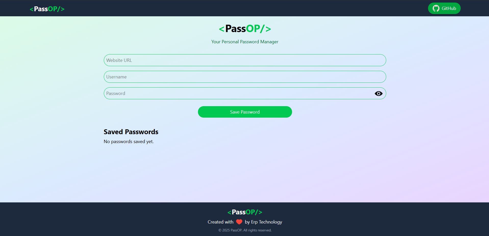

# 🔐 Password Manager

A secure password manager built using the **MERN Stack** (MongoDB, Express, React, Node.js). This app allows users to store and manage their credentials with client-side encryption and authentication.

## 🚀 Live Demo

🔗 [Live Website](https://erp-password-manager.vercel.app/)

## 🛠️ Tech Stack

- **Frontend:** React, Tailwind CSS
- **Backend:** Node.js, Express.js
- **Database:** MongoDB (Atlas)
- **Authentication:** JWT (JSON Web Tokens)
- **Security:** bcrypt, HTTPS, Helmet, dotenv
  
## ✨ Features

- ✅ User authentication (JWT-based)
- ✅ Add, edit, and delete credentials
- ✅ Secure password encryption
- ✅ Responsive UI with Tailwind CSS
- ✅ Protected routes and validation
- ✅ Light/Dark mode toggle (optional)

## 📸 Screenshots


## 📦 Installation

### Clone the Repository

```bash
git clone https://github.com/ErRahulPanchta/password-manager.git
cd password-manager
